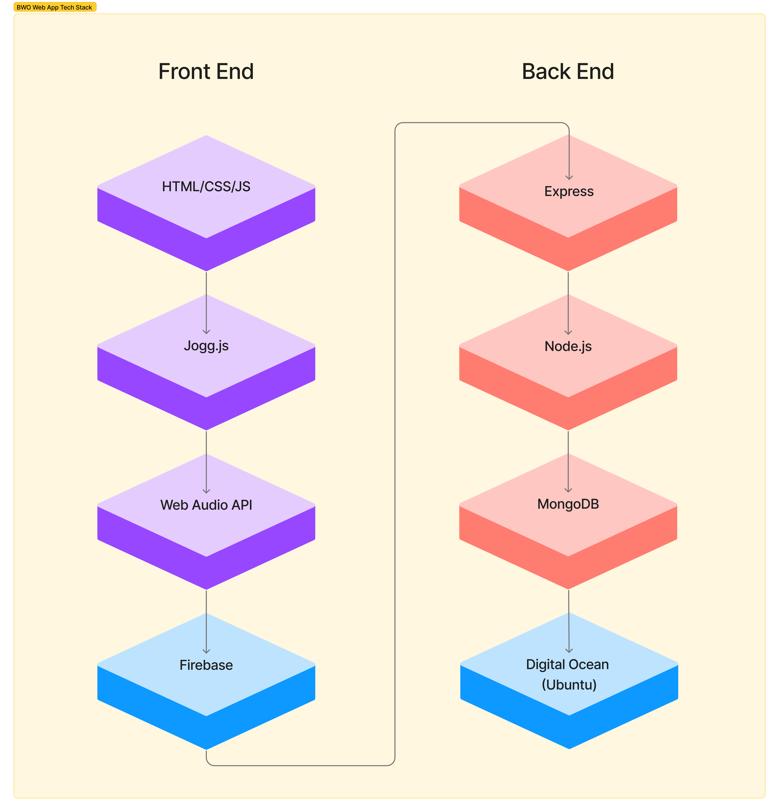

# Burp World Online

Burp World Online is an exploration of sound design as interface design. By reimagining the online social space as one that is free of the distraction of screens and visual social biases, it fosters a new way of interacting with the computer and with each other through sound, voice, and listening.

_this is the old text_
It's time to celebrate the ugly and the stupid. It's time to honour the mighty burp with an online social space that it deserves. Using a sound-based user interface, Burp World Online makes it easy to share your burps with other gassy folks without the distraction of screens and visual social biases.

Sound is the ultimate online metaphysical embodiment.

Information Design + Interaction Design + Product Design + Sound + Tech & Society

[burpworld.online](https://burpworld.online)

## Table of Contents

- [Abstract](#abstract)
- [Key Features](#key-features)
- [Technical Details](#technical-details)
- [Research and Context](#research-and-context)

## Abstract
Burps have long been disrespected as an unserious form of sonic media. Labelled "vulgar" and "classless", the art of the belch is often responded to with vitriol and grimaces. 

For a large number of people burping is a way of life. Whether it be IBS or an addiction to Diet Cokes, those who know the truth of living with gas know that there's no holding it in. Be sneaky and pray for an inconspicuous release or disgust the people around you, it's a situation that gassy people can never win. That is until Burp World Online.

Burp World Online is a safe haven for burpers and belchers, where gas is celebrated and not criticised. 

I've found a gap in the market: there's no social media platform designed for the luscious sonic qualities of burps. Text based social media platforms like Twitter fall short, relying on the untrustworthy phoenetic interpretation of the burper. Video platforms like YouTube add too much bulk around the short and sweet burp. Platforms like Instagram and TikTok prioritise people that are hot, not the best burpers.

Burp World Online is made for the serious burper, using a fully sound-based user interface that respects the righteous burp. We've made it casual, spontaneous, and effortless to share your burp with the world.

## Key Features
Burp World Online allows you to:
* post your burps
* listen to burps from other users
* respond to burp threads
* quickly scrub through audio threads
* navigate through user profiles

## Technical Details

Burp World Online runs on Node.js with Express, using Firebase for authentication and storage, and uses a MongoDB database. [burpworld.online](burpworld.online) is deployed on Digital Ocean

The web client is built with HTML, CSS, JS, and uses [Jogg.js](), a custom-built Javascript abstraction layer built on top of the Web Audio API designed to create interactive audio interfaces.

## Research and Context
Burp World Online uses a "For You Page" style of content organisation, relying on an algorithm to populate the main feed.

Burp World Online is heavily influenced by voice apps such as WeChat, Whatsapp, Clubhouse, and the voice message feature in iMessage. Similar user generated podcasting apps include Cappuccino, Amp, and Spotify for Podcasters (fka Anchor).

This project takes into account the legacy and sociological impacts of sound based interactions, including voice assistants, DTMF Auto Attendants, telephone operators, and radio programming. This project also investigates the realm of sound design, especially as it pertains to game and interface design. 

The development of Burp World Online investigated the world of audio Javascript libraries. Initial developments attempted to use Tone.js as the basis of UI elements but it was found that the timeline-based workflows were too limiting to create the variation in audio element playback. Development shifted to a lower level scope, working directly with the Web Audio API and ultimately resulted in the creation of Jogg.js.

Sound design, sonic branding, etc etc

### Further Reading
"Designing Sound" by Andy Farnell
